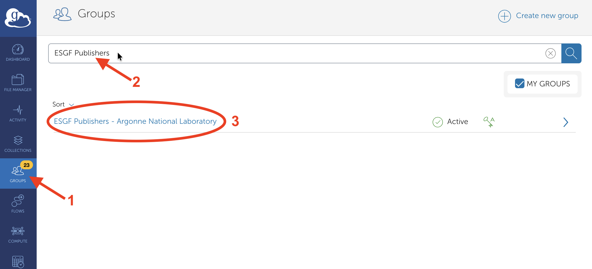
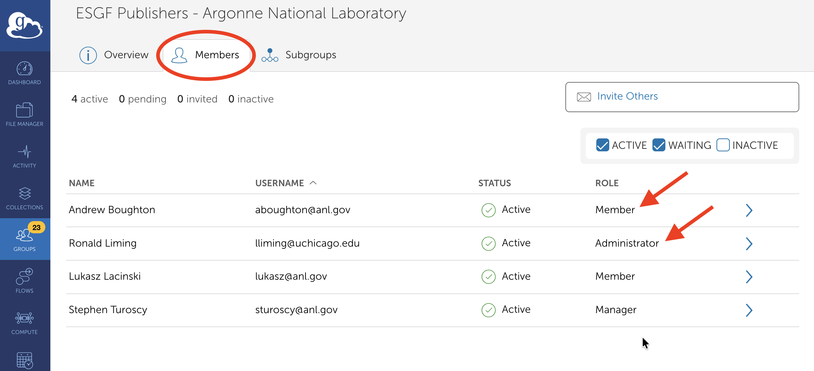
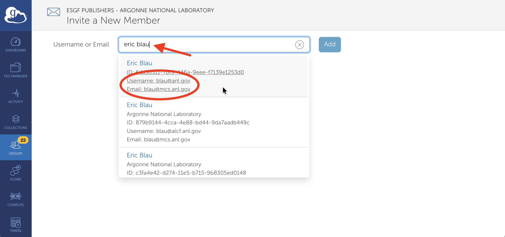

# Managing Your Team's ESGF-NG Permissions in the West Catalog

The ESGF-NG West catalog onboards institutions, not individuals. When your institution is onboarded,
we create a group. Permissions in the ESGF-NG catalog are granted to all members of the group.
Certain individuals at your institution ("group managers") are permitted to add or remove group members. So once your group is created, you can onboard
(or offboard) individuals at your institution without assistance from the ESGF-NG West operators.

This page provides instructions for how to manage your institution's ESGF-NG group so you can
onboard and offboard individuals at your institution.

## Identify Your Group Managers

Permission to add or remove group members is limited to specific individuals at your institution. We call these individuals "group managers." Group managers are initially determined when your institution is onboarded and your institution's group is created, but they can be changed later if needed. Any member of the group can view the group's members and see which ones are group managers.

To see your group's members and identify the group managers, login at the [Globus web app](https://app.globus.org/) and then click "Groups" in the left (blue) panel. Type "ESGF" and your institution's name in the search box, and look for a group named "ESGF Publishers - \<Your Institution\>."

Click the group's name, and then click the "Members" tab at the top of the group information panel. You'll see the list of all group members. Members whose role is "Administrator" or "Manager" are group managers who can add and remove members.

## Manage Group Members

If you are a group manager, you can add and remove other members. To add a new member, click the "Invite Others" button on the Members view. Then enter the name of the person you want to invite. Globus will list people with that name. Be careful to look at the username and email address fields to make sure you have the right person, as there may be many people with the same name.

Click the name of the person you wish to invite, then follow Globus's prompts to invite the person to your group.

If name search does not find the person you wish to invite, you can type their email address into the search box instead. They will receive an email invitation, and can follow Globus's prompts to sign into Globus and accept the invitation.

To remove a member from your group, click the member's name in the Members view, then click the "Remove Membership" button on the member details view.
